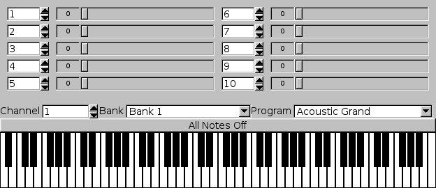

# **Virtual MIDI Keyboard**

<figure markdown="span">

<figcaption>Virtual MIDI keyboard</figcaption>
</figure>

  
The Virtual Keyboard is a Plugin in widgets. This opcode is part of the plugin repository and has to be installed separately. This FLTK widget does not work on the Mac.The plugin repository can be found here:  [https://github.com/csound/plugins](https://github.com/csound/plugins).

The virtual MIDI keyboard module (activated using -+rtmidi=virtual on thecommand line flags) provides a way of sending realtime MIDI information toCsound without the need of a MIDI device. It can send note information,control changes, bank and program changes on a specified channel. The MIDIinformation from the virtual keyboard is processed by Csound in exactly thesame way as MIDI information that comes from the other MIDI drivers, so ifyour Csound orchestra is designed to work with hardware MIDI devices, thiswill also work.

For the device flag (-M), the virtual keyboard uses this to take in the nameof a keyboard mapping files. Like all MIDI drivers, a device must be givento activate the driver. If you would like to just use the default settingsof the keyboard, simply passing in 0 (i.e. -M0) and the virtual keyboardwill use its default settings. If instead of the 0 a name of a file isgiven, the keyboard will attempt to load the file as a keyboard mapping. Ifthe file could not be opened or read correctly, the default settings will beused.

Keyboard Mapping files allow the user to customize the name and number of banksas well as the name and number of programs per bank.  The following examplekeyboard mapping (named keyboard.map) has inline comments on the file format.This file is also available with the Csound source distribution in theInOut/virtual_keyboard folder.

```
# Custom Keyboard Map for Virtual Keyboard
# Steven Yi
#
# USAGE
#
# When using the Virtual Keyboard, you can supply a filename for a mapping
# of banks and programs via the -M flag, for example:
#
# csound -+rtmidi=virtual -Mkeyboard.map my_project.csd
#
# INFORMATION ON THE FORMAT
#
# -lines that start with '#' are comments
# -lines that have [] start new bank definitions,
#  the contents are bankNum=bankName, with bankNum=[1,16384]
# -lines following bank statements are program definitions
#  in the format programNum=programName, with programNum=[1,128]
# -bankNumbers and programNumbers are defined in this file
#  starting with 1, but are converted to midi values (starting
#  with 0) when read
#
# NOTES
#
# -if an invalid bank definition is found, all program
#  defintions that follow will be ignored until a new
#  valid bank definition is found
# -if a valid bank is defined by no valid programs found
#  for that bank, it will default to General MIDI program
#  definitions
# -if an invalid program definition is found, it will be
#  ignored

[1=My Bank]
1=My Test Patch 1
2=My Test Patch 2
30=My Test Patch 30

[2=My Bank2]
1=My Test Patch 1(bank2)
2=My Test Patch 2(bank2)
30=My Test Patch 30(bank3)
```
The ten sliders up top are by default set to MIDI Controller number 1-10though they can be changed to whatever one wishes to use. The controllernumbers and values of each slider are set per channel, so one may usedifferent settings and values for each channel.

By default there are 128 banks and for each bank 128 patches defaulting toGeneral Midi names. The MIDI bank standard uses 14-bit resolution to support16384 possible banks, but the bank numbers by default are 0-127. To usevalues higher than 127, one should use a custom keyboard map and set thedesired bank number value for the bank name. The virtual keyboard willcorrectly transmit the bank number as MSB and LSB with controller numbers 0and 32.

Beyond the input available from interacting with the GUI via mouse, one mayalso trigger off MIDI notes by using the ASCII keyboard when the virtualkeyboard window is focused. The layout is done much like a tracker and offerstwo octaves and a major third to trigger, starting from Middle-C (MIDI note 60).The ASCII keyboard MIDI note values are given in the following table.

#### ASCII Keyboard MIDI Note Values

| Keyboard Key | MIDI Value |
|---|-----|
| z |  60 |
| s |  61 |
| x |  62 |
| d |  63 |
| c |  64 |
| v |  65 |
| g |  66 |
| b |  67 |
| h |  68 |
| n |  69 |
| j |  70 |
| m |  71 |
| q |  72 |
| 2 |  73 |
| w |  74 |
| 3 |  75 |
| e |  76 |
| r |  77 |
| 5 |  78 |
| t |  79 |
| 6 |  80 |
| y |  81 |
| 7 |  82 |
| u |  83 |
| i |  84 |
| 9 |  85 |
| o |  86 |
| 0 |  87 |
| p |  88 |

Here's an example of usage of the virtual MIDI keyboard. It uses the file [virtual.csd](../examples/virtual.csd).

``` csound-orc title="Example of the chuap opcode." linenums="1"
--8<-- "examples/virtual.csd"
```
