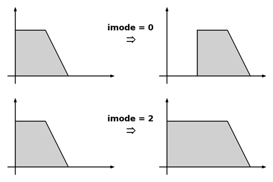

<!--
id:delayk
category:Signal Modifiers:Delay
-->
# delayk
Delays an input signal by some time interval.

k-rate delay opcodes

## Syntax
``` csound-orc
kr delayk   ksig, idel[, imode]
kr vdel_k   ksig, kdel, imdel[, imode]
```

### Initialization

_idel_ -- delay time (in seconds) for delayk. It is rounded to the nearest integer multiple of a k-cycle (i.e. 1/kr).

_imode_ -- sum of 1 for skipping initialization (e.g. in tied notes) and 2 for holding the first input value during the initial delay, instead of outputting zero. This is mainly of use when delaying envelopes that do not start at zero.

<figure markdown="span">

<figcaption></figcaption>
</figure>

_imdel_ -- maximum delay time for vdel_k, in seconds.

### Performance

_kr_ -- the output signal. Note: neither of the opcodes interpolate the output.

_ksig_ -- the input signal.

_kdel_ -- delay time (in seconds) for vdel_k. It is rounded to the nearest integer multiple of a k-cycle
(i.e. 1/kr).

## Examples

Here is an example of the delayk opcode. It uses the file [delayk.csd](../../examples/delayk.csd).

``` csound-csd title="Example of the delayk opcode." linenums="1"
--8<-- "examples/delayk.csd"
```

## See also

[Delay](../../sigmod/delayops)

## Credits

Istvan Varga.
