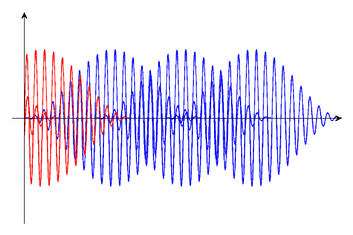

<!--
id:grain3
category:Signal Generators:Granular Synthesis
-->
# grain3
Generate granular synthesis textures with more user control.

[grain2](../../opcodes/grain2)  is simpler to use but _grain3_ offers more control.

## Syntax
```csound-orc
ares grain3 kcps, kphs, kfmd, kpmd, kgdur, kdens, imaxovr, kfn, iwfn, \
            kfrpow, kprpow [, iseed] [, imode]
```

### Initialization
_imaxovr_ -- maximum number of overlapping grains. The number of overlaps can be calculated by (_kdens_ * _kgdur_); however, it can be overestimated at no cost in rendering time, and a single overlap uses (depending on system) 16 to 32 bytes of memory.
  
_iwfn_ -- function table containing window waveform (Use [GEN20](../../scoregens/gen20) to calculate _iwfn_).
  
_iseed_ (optional, default=0) -- seed value for random number generator (positive integer in the range 1 to 2147483646 (2<sup>31</sup> - 2)). Zero or negative value seeds from current time (this is also the default).
  
_imode_ (optional, default=0) -- sum of the following values:

  * _64:_ synchronize start phase of grains to _kcps_.  
  * _32:_ start all grains at integer sample location. This may be faster in some cases, however it also makes the timing of grain envelopes less accurate.  
  * _16:_ do not render grains with start time less than zero. (see the image below; this option turns off grains marked with red on the image).  
  * _8:_ interpolate window waveform (slower).  
  * _4:_ do not interpolate grain waveform (fast, but lower quality).  
  * _2:_ grain frequency is continuously modified by _kcps_ and _kfmd_ (by default, each grain keeps the frequency it was launched with). This may be slower at high control rates. It also controls phase modulation (_kphs_).  
  * _1:_ skip initialization.  

<figure markdown="span">
  
  <figcaption>A diagram showing grains with a start time less than zero in red.</figcaption>
</figure>

### Performance
_ares_ -- output signal.
  
_kcps_ -- grain frequency in Hz.
  
_kphs_ -- grain phase. This is the location in the grain waveform table, expressed
as a fraction (between 0 to 1) of the table length.
  
_kfmd_ -- random variation (bipolar) in grain frequency in Hz.
  
_kpmd_ -- random variation (bipolar) in start phase.
  
_kgdur_ -- grain duration in seconds. _kgdur_ also controls the duration of already active grains (actually the speed at which the window function is read). This behavior does not depend on the _imode_ flags.
  
_kdens_ -- number of grains per second.
  
_kfrpow_ -- this value controls the distribution of grain frequency variation.  If _kfrpow_ is positive, the random distribution (x is in the range -1 to 1) is
```
    abs(x) ^ ((1 / kfrpow) - 1)
```
For negative _kfrpow_ values, it is
```
(1 - abs(x)) ^ ((-1 / kfrpow) - 1)
```
Setting _kfrpow_ to -1, 0, or 1 will result in uniform distribution (this is also faster to calculate). The image below shows some examples for _kfrpow_. The default value of _kfrpow_ is 0.
  
<figure markdown="span">
  
  <figcaption>A graph of distributions for different values of kfrpow</figcaption>
</figure>

_kprpow_ -- distribution of random phase variation (see _kfrpow_).  Setting _kphs_ and _kpmd_ to 0.5, and _kprpow_ to 0 will emulate _grain2_.
  
_kfn_ -- function table containing grain waveform. Table number can be changed at k-rate (this is useful to select from a set of band-limited tables generated by Use [GEN30](../../scoregens/gen30), to avoid aliasing).
  
  
> :memo: **Note**  
>  
>  _grain3_ internally uses the same random number generator as _rnd31_. So reading  [its documentation](../../opcodes/rnd31)  is also recommended.

## Examples
Here is an example of the grain3 opcode. It uses the file [grain3.csd](../../examples/grain3.csd).
``` csound-orc title="Example of the grain3 opcode." linenums="1"
--8<-- "examples/grain3.csd"
```

## See Also
[Granular Synthesis](../../siggen/granular)

## Credits
Author: Istvan Varga

New in version 4.15  
Updated April 2002 by Istvan Varga
